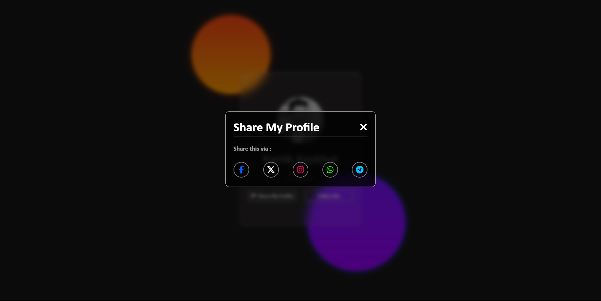

# User Profile Card Mini Project

This mini project demonstrates a user profile card with interactive features using HTML, CSS, and JavaScript. The profile card includes a share functionality that opens a modal with various sharing options.

## Project Overview

- **Author:** Kartik Kesbhat
- **Role:** Developer

## Features

- User profile card with a profile picture, name, and subtitle.
- Interactive buttons to share the profile and follow the user.
- Animated circular elements on the background.
- Modal for sharing options with social media icons.
- Responsive design for various screen sizes.

## Screenshots

